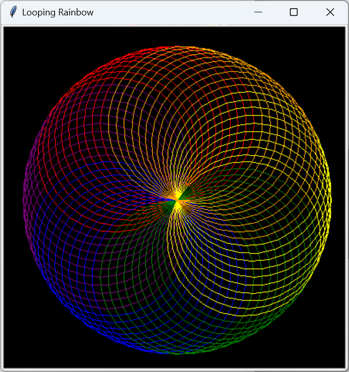
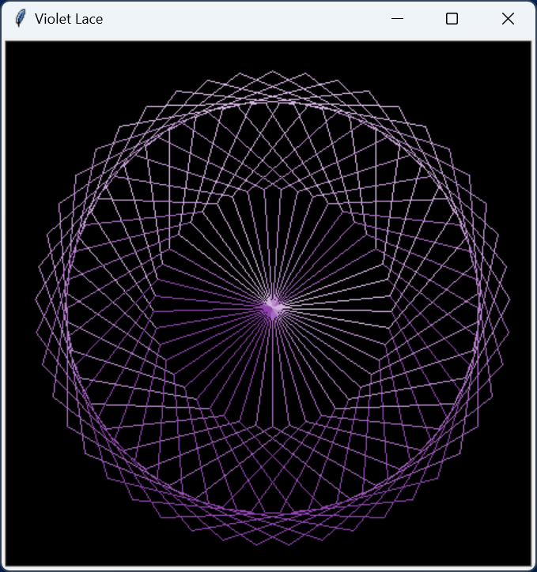

# Spirographical
## Copyright (c) 2023 TigerPointe Software, LLC

## Description
A Python module to draw spirographical images using turtle programming.


```
import spirographical as sg
sg.draw()
```


```
import spirographical as sg
sg.draw(colors=['hotpink', 'hotpink', 'cornflowerblue', 'cornflowerblue'],
        title='Pastel Weave', loops=70, skiploops=2, twist=-10)
```


```
import spirographical as sg
sg.draw(colors=['lightsteelblue', 'cornflowerblue', 'royalblue',
                'blue', 'mediumblue', 'navy', 'midnightblue'],
        title='Blue Spiral', loops=40, skiploops=1, twist=3)
```



```
import spirographical as sg
sg.loop()
```



```
sg.loop(colors=['#d2b4de', '#bb8fce', '#a569bd', '#8e44ad',
                '#8e44ad', '#a569bd', '#bb8fce', '#d2b4de'],
        title='Violet Lace', steps=6)
```

Please consider giving to cancer research.

## Make a Difference
If you enjoy this software, please consider donating to one of the following:

[American Cancer Society](https://www.cancer.org)

[National Brain Tumor Society](https://braintumor.org)